#  Граф бизнес-логики Rebalance Finance

##  Общая архитектура бизнес-логики

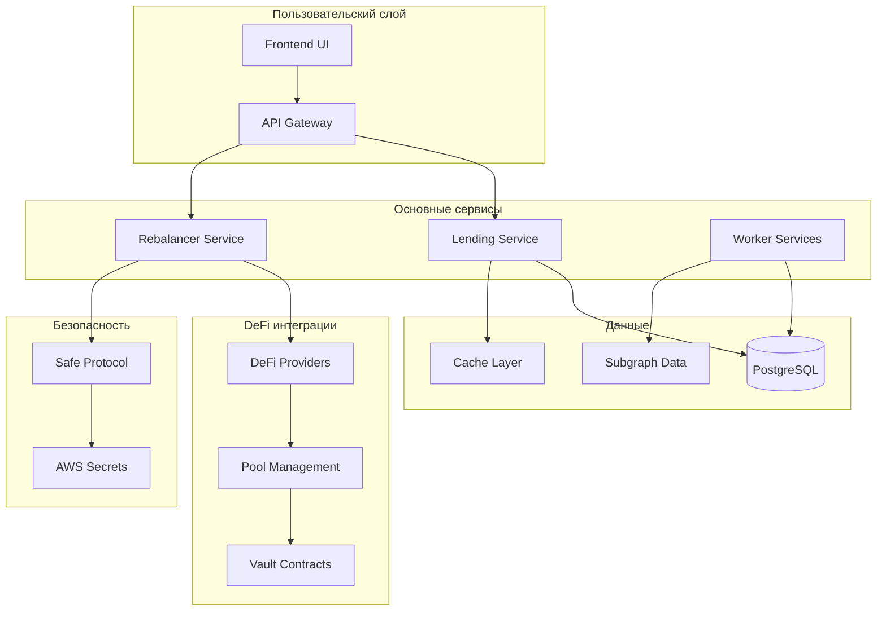

##  Основные бизнес-процессы

### 1. Автоматическое ребалансирование

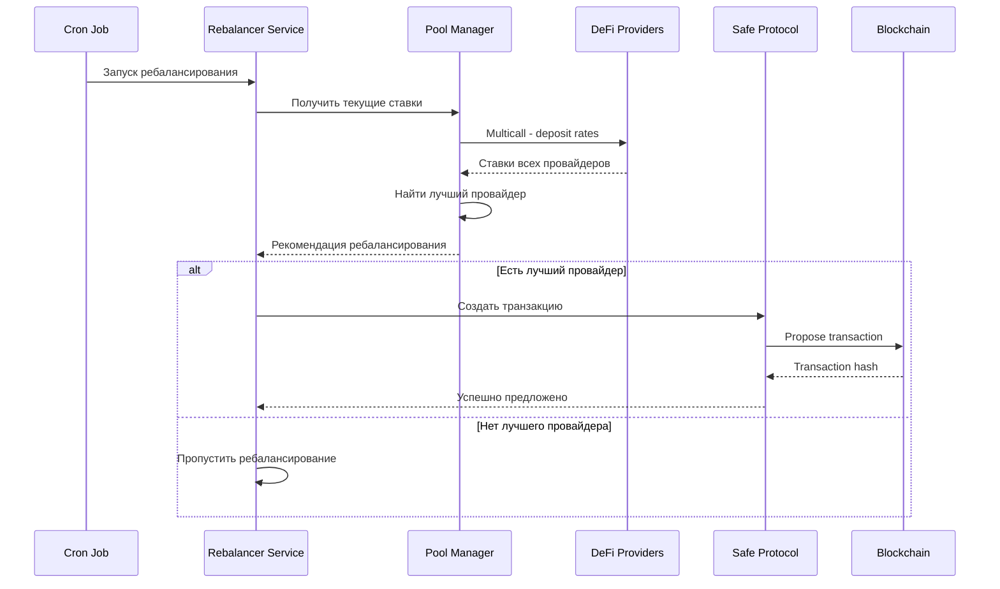

### 2. Система наград и очков

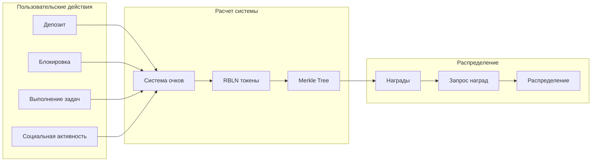

### 3. Мониторинг и сбор данных

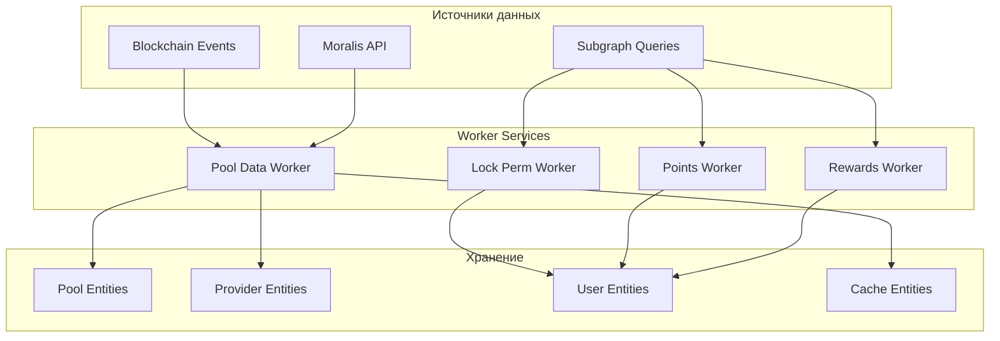

##  DeFi провайдеры и интеграции

### Поддерживаемые протоколы

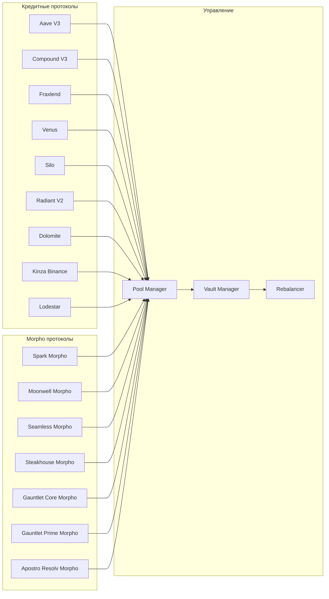

##  API и бизнес-логика

### Основные эндпоинты и их логика

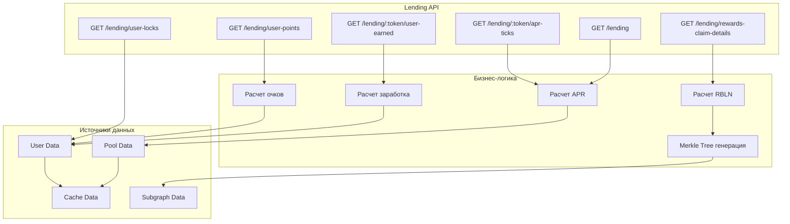

##  Безопасность и транзакции

### Процесс безопасных транзакций

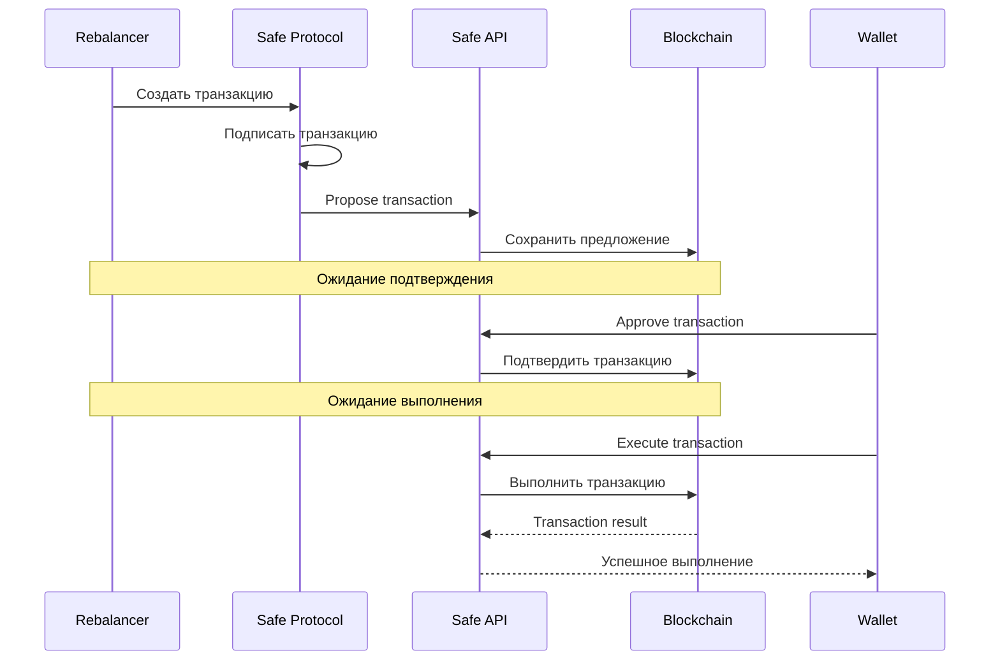

##  Система геймификации

### Логика начисления очков и наград

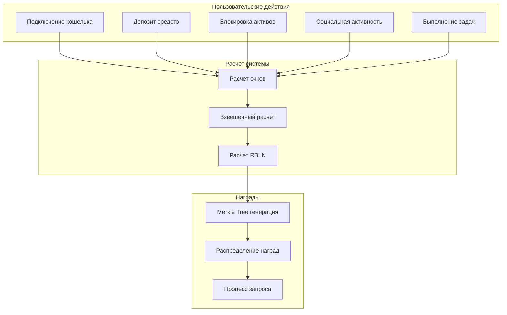

##  Мониторинг и аналитика

### Система мониторинга

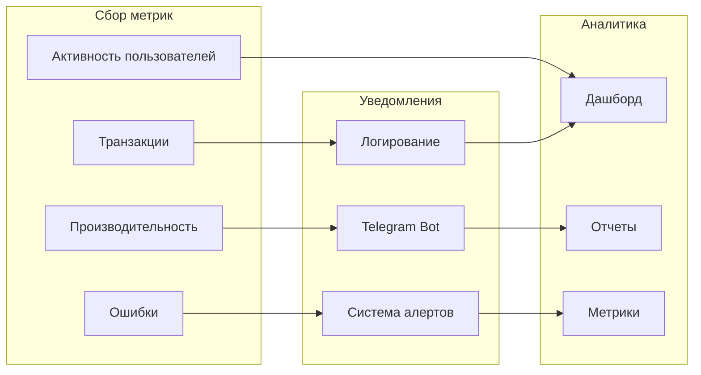

##  Жизненный цикл данных

### Поток данных в системе

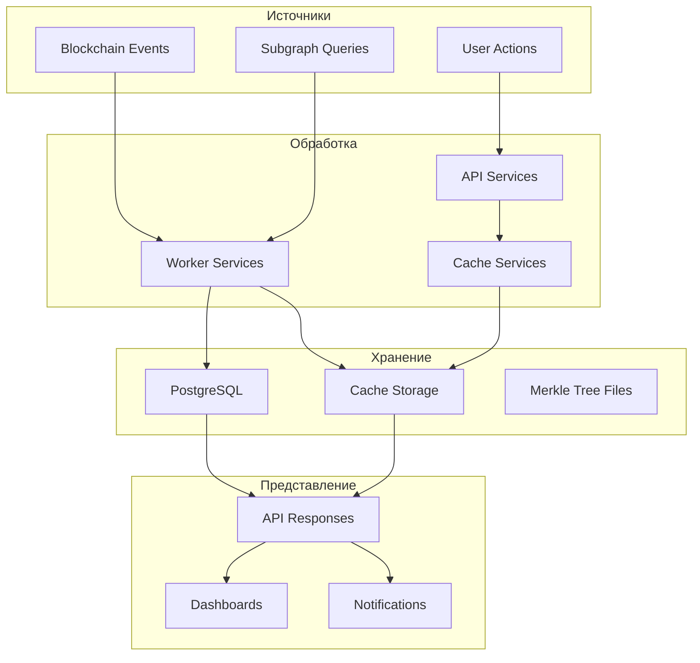

##  Ключевые бизнес-метрики

### Основные KPI системы

```mermaid
graph TB
    subgraph " Финансовые метрики"
        TVL[Total Value Locked]
        APR[Average APR]
        EARNINGS[User Earnings]
        REBALANCE_FREQ[Rebalance Frequency]
    end
    
    subgraph " Пользовательские метрики"
        ACTIVE_USERS[Active Users]
        USER_RETENTION[User Retention]
        POINTS_DISTRIBUTION[Points Distribution]
        REWARDS_CLAIMED[Rewards Claimed]
    end
    
    subgraph "Технические метрики"
        UPTIME[System Uptime]
        TRANSACTION_SUCCESS[Transaction Success Rate]
        CACHE_HIT_RATE[Cache Hit Rate]
        RESPONSE_TIME[API Response Time]
    end
    
    subgraph "Аналитика"
        PERFORMANCE_DASHBOARD[Performance Dashboard]
        USER_ANALYTICS[User Analytics]
        FINANCIAL_REPORTS[Financial Reports]
        SYSTEM_HEALTH[System Health]
    end
    
    TVL --> PERFORMANCE_DASHBOARD
    APR --> FINANCIAL_REPORTS
    EARNINGS --> USER_ANALYTICS
    REBALANCE_FREQ --> SYSTEM_HEALTH
    
    ACTIVE_USERS --> USER_ANALYTICS
    USER_RETENTION --> PERFORMANCE_DASHBOARD
    POINTS_DISTRIBUTION --> USER_ANALYTICS
    REWARDS_CLAIMED --> FINANCIAL_REPORTS
    
    UPTIME --> SYSTEM_HEALTH
    TRANSACTION_SUCCESS --> PERFORMANCE_DASHBOARD
    CACHE_HIT_RATE --> SYSTEM_HEALTH
    RESPONSE_TIME --> PERFORMANCE_DASHBOARD
```

---

##  Резюме бизнес-логики

###  Основные бизнес-процессы:

1. **Автоматическое ребалансирование** - постоянный мониторинг и переключение между провайдерами для максимизации APR
2. **Система наград** - геймификация с очками и RBLN токенами для увеличения пользовательской активности
3. **Безопасные транзакции** - мультисиг транзакции через Safe Protocol
4. **Мониторинг данных** - сбор и анализ данных из блокчейна и subgraph
5. **API сервисы** - предоставление данных для фронтенда и внешних интеграций

###  Ключевые особенности:

- **Мультисетевая поддержка** (Arbitrum, BSC, Base)
- **Интеграция с 15+ DeFi протоколами**
- **Система кэширования** для оптимизации производительности
- **Telegram уведомления** для мониторинга
- **Merkle tree** для эффективного распределения наград
- **TypeScript** для типобезопасности
- **Nx monorepo** для масштабируемости