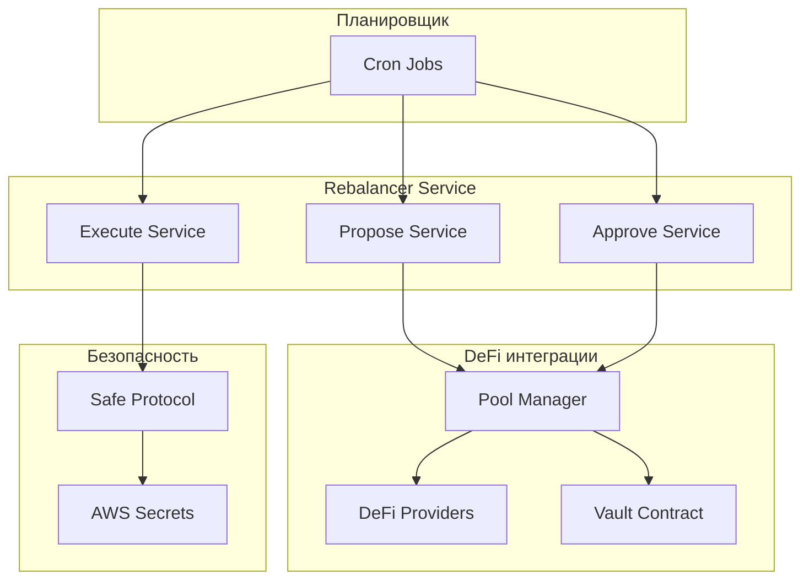
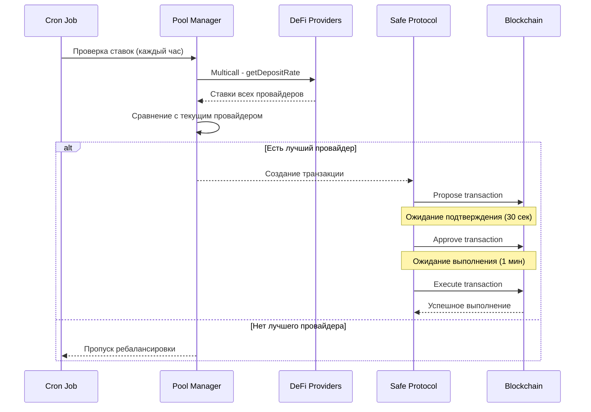

#  Анализ сервиса Rebalancer

##  Обзор сервиса

Сервис **Rebalancer** - это ключевой компонент системы Rebalance Finance, отвечающий за автоматическое переключение активов между различными DeFi протоколами кредитования для максимизации доходности пользователей.

##  Архитектура сервиса

### Структура компонентов



##  Логика ребалансировки

### Основной алгоритм (Simple Strategy)

```typescript
// Ключевая логика в Pool.rebalanceSimple()
private async rebalanceSimple(blockNumber: number) {
  // 1. Получение ставок депозитов всех провайдеров
  const depositRates = await this.depositRates(blockNumber);
  
  // 2. Сопоставление провайдеров со ставками
  const providersWithDepositRates = this.providers.map((provider, index) => ({
    provider,
    depositRate: depositRates[index],
  }));
  
  // 3. Поиск провайдера с максимальной ставкой
  const newActiveProviderWithDepositRate = providersWithDepositRates.reduce(
    (max, current) => (current.depositRate > max.depositRate ? current : max),
    providersWithDepositRates[0]
  );
  
  // 4. Получение текущего активного провайдера
  const activeProvider = await this.vault.activeProvider({ blockTag: blockNumber });
  
  // 5. Сравнение ставок
  const activeProviderWithDepositRate = providersWithDepositRates.find(
    (providerWithDepositRate) => providerWithDepositRate.provider.contract.target == activeProvider
  );
  
  // 6. Решение о ребалансировке
  if (activeProviderWithDepositRate.depositRate == newActiveProviderWithDepositRate.depositRate) 
    return null; // Нет необходимости в ребалансировке
  
  // 7. Возврат параметров для ребалансировки
  return [
    this.vault.target,           // Адрес vault
    MaxUint256,                  // Максимальное количество токенов
    activeProviderWithDepositRate.provider.contract.target,    // Текущий провайдер
    newActiveProviderWithDepositRate.provider.contract.target, // Новый провайдер
    0n,                          // Минимальное количество токенов
    true,                        // Флаг ребалансировки
  ];
}
```

##  Критерии выбора пулов

### 1. **Основной критерий: Deposit Rate (APR)**

```typescript
// Получение ставок депозитов через multicall
private async depositRates(blockNumber: number) {
  const aggregateData = this.providers.map((provider) => ({
    target: provider.contract.target,
    callData: Interfaces.IProviderMulticallInterface.getDepositRate.callData(this.vault.target),
    callBack: Interfaces.IProviderMulticallInterface.getDepositRate.callBack,
  }));
  
  const aggregateResult = await multicalls[this.network].aggregate.staticCall(aggregateData, {
    blockTag: blockNumber,
  });
  
  return aggregateResult.returnData.map((data, index) => aggregateData[index].callBack(data));
}
```

### 2. **Расчет взвешенной ставки пула**

```typescript
public async depositRate(blockNumber: number) {
  const [balances, depositRates] = await Promise.all([
    this.balances(blockNumber), 
    this.depositRates(blockNumber)
  ]);
  
  const totalBalances = balances.reduce((total, balance) => (total += balance), 0n);
  const weightedBalances = balances.map((balance, index) => balance * depositRates[index]);
  const totalWeightedBalance = weightedBalances.reduce((total, weightedBalance) => (total += weightedBalance), 0n);
  
  if (totalBalances > 0) 
    return totalWeightedBalance / totalBalances; // Взвешенная ставка
  
  // Если нет балансов, возвращаем ставку активного провайдера
  const activeProviderAddress = await this.vault.activeProvider({ blockTag: blockNumber });
  const activeProvider = this.providers.find((provider) => provider.contract.target == activeProviderAddress);
  return await activeProvider.contract.getDepositRate.staticCall(this.vault.target, { blockTag: blockNumber });
}
```

### 3. **Условия для ребалансировки**

- **Строгое сравнение**: `activeProviderRate == newProviderRate` → нет ребалансировки
- **Любое улучшение**: `newProviderRate > activeProviderRate` → ребалансировка
- **Нет минимального порога**: система реагирует на любое улучшение ставки

##  Временные интервалы

### Cron расписание

```typescript
export enum CronExpressions {
  Propose = CronExpression.EVERY_HOUR,    // Каждый час
  Approve = CronExpression.EVERY_30_SECONDS, // Каждые 30 секунд
  Execute = CronExpression.EVERY_MINUTE,  // Каждую минуту
}
```

### Логика временных интервалов

1. **Propose (каждый час)**: Проверка необходимости ребалансировки
2. **Approve (каждые 30 сек)**: Быстрое подтверждение транзакций
3. **Execute (каждую минуту)**: Выполнение подтвержденных транзакций

##  Процесс безопасных транзакций

### 1. **Propose Service**

```typescript
@Cron(CronExpressions.Propose)
public async propose() {
  const blockNumber = await jsonRpcProviders[this.network].getBlockNumber();
  const args = await pools[this.network][this.token].rebalance(this.strategy, blockNumber);
  
  if (!args) {
    Logger.log('Nothing to propose');
    return;
  }
  
  // Создание Safe транзакции
  const data = VaultManager__factory.createInterface().encodeFunctionData('rebalanceVault', args);
  const safeTransactionData: SafeTransactionDataPartial = {
    to: pools[this.network][this.token].vaultManagerAddress,
    data,
    value: '0',
  };
  
  // Подписание и предложение транзакции
  const safeTransaction = await this.safe.createTransaction({ transactions: [safeTransactionData] });
  const safeTxHash = await this.safe.getTransactionHash(safeTransaction);
  const senderSignature = await this.safe.signHash(safeTxHash);
  
  await this.safeApiKit.proposeTransaction({
    safeAddress: pools[this.network][this.token].safeAddress,
    safeTransactionData: safeTransaction.data,
    safeTxHash,
    senderAddress: this.wallet.address,
    senderSignature: senderSignature.data,
    origin: blockNumber.toString(),
  });
}
```

### 2. **Approve Service**

```typescript
@Cron(CronExpressions.Approve)
public async approve() {
  const safeTxs = await this.safeApiKit.getPendingTransactions(pools[this.network][this.token].safeAddress);
  
  if (safeTxs.count == 0) return;
  
  const safeTx = safeTxs.results[0];
  
  // Проверка, что уже не подтверждено
  if (safeTx.confirmations.find((confirmation) => confirmation.owner == this.wallet.address)) {
    return;
  }
  
  // Валидация транзакции
  const blockNumber = parseInt(safeTx.origin);
  const data = VaultManager__factory.createInterface().encodeFunctionData(
    'rebalanceVault',
    await pools[this.network][this.token].rebalance(this.strategy, blockNumber)
  );
  
  if (data != safeTx.data) 
    throw new Error(`Rejected. Safe transaction hash: ${safeTx.safeTxHash}`);
  
  // Подтверждение транзакции
  await this.safeApiKit.confirmTransaction(
    safeTx.safeTxHash,
    await this.safe.signHash(safeTx.safeTxHash).then((res) => res.data)
  );
}
```

### 3. **Execute Service**

```typescript
@Cron(CronExpressions.Execute)
private async execute() {
  const safeTxs = await this.safeApiKit.getPendingTransactions(pools[this.network][this.token].safeAddress);
  
  if (safeTxs.count == 0) return;
  
  const safeTx = safeTxs.results[0];
  
  // Проверка достаточности подтверждений
  if (safeTx.confirmationsRequired > safeTx.confirmations.length)
    throw new Error(`Not enough confirmations. Safe transaction hash: ${safeTx.safeTxHash}`);
  
  // Выполнение транзакции
  const executedTx = await this.safe.executeTransaction(safeTx);
  const txReceipt = await executedTx.transactionResponse?.wait();
  
  if (!(txReceipt?.status == 1)) 
    throw new Error(`Failed. Transaction hash: ${executedTx.hash}`);
}
```

##  Поддерживаемые провайдеры

### Конфигурация пулов

```typescript
// Пример конфигурации для USDT на Arbitrum
[Enums.TokenEnum.USDT]: new Pool(
  Rebalancer__factory.connect('0x2469c01daf31b68603Bd57E2FFf75E548223EA17', jsonRpcProviders[Enums.NetworkEnum.Arbitrum]),
  [
    new CompoundV3Provider('0x2CeB49E36c23364082e8b476777D94Dba79E6571', Enums.NetworkEnum.Arbitrum),
    new AaveV3Provider('0xD275d04BCd03898d54d3aA8229F1e9ceE0f6afc1', Enums.NetworkEnum.Arbitrum),
    new DolomiteProvider('0x2277758D77b3FD7F834fa95ecDCc0739094CCf46', Enums.NetworkEnum.Arbitrum),
  ],
  Enums.NetworkEnum.Arbitrum,
  '0x0cA0872857D12f9921a7aF71716055E52FE476c3', // Safe address
  '0xBC02429cC88e26d628830C45838fE2dA8da339c3'  // Vault manager address
)
```

### Список провайдеров по токенам

| Токен | Провайдеры |
|-------|------------|
| USDT | Compound V3, Aave V3, Dolomite |
| wETH | Compound V3, Aave V3, Dolomite |
| USDC | Compound V3, Aave V3, Dolomite |
| USDC.e | Compound V3, Aave V3, Dolomite |
| DAI | Aave V3, Dolomite |
| FRAX | Aave V3, Fraxlend, Venus, Spark Morpho, Moonwell Morpho, Seamless Morpho, Steakhouse Morpho, Gauntlet Core Morpho, Gauntlet Prime Morpho, Apostro Resolv Morpho |

##  Бизнес-задачи сервиса

### 1. **Максимизация доходности**
- Автоматический поиск лучших ставок APR среди всех провайдеров
- Мгновенное переключение при улучшении условий
- Оптимизация взвешенной доходности пула

### 2. **Автоматизация управления**
- Устранение ручного мониторинга ставок
- Автоматическое принятие решений о ребалансировке
- Снижение операционных расходов

### 3. **Безопасность транзакций**
- Мультисиг подтверждения через Safe Protocol
- Валидация транзакций перед выполнением
- Защита от несанкционированных операций

### 4. **Мониторинг и прозрачность**
- Логирование всех операций ребалансировки
- Отслеживание изменений ставок
- Уведомления через Telegram

### 5. **Масштабируемость**
- Поддержка множественных токенов и сетей
- Модульная архитектура для добавления новых провайдеров
- Эффективное использование multicall для оптимизации

##  Метрики эффективности

### Ключевые показатели

1. **Частота ребалансировок** - сколько раз происходило переключение
2. **Улучшение APR** - среднее увеличение ставки после ребалансировки
3. **Время выполнения** - скорость от предложения до выполнения
4. **Успешность транзакций** - процент успешных ребалансировок
5. **Газовые расходы** - стоимость операций ребалансировки

### Ограничения и риски

1. **Газовые расходы** - частые ребалансировки могут быть дорогими
2. **Волатильность ставок** - быстрые изменения могут привести к частым переключениям
3. **Задержки блокчейна** - время подтверждения транзакций
4. **Риски смарт-контрактов** - зависимость от безопасности провайдеров

##  Жизненный цикл ребалансировки


---