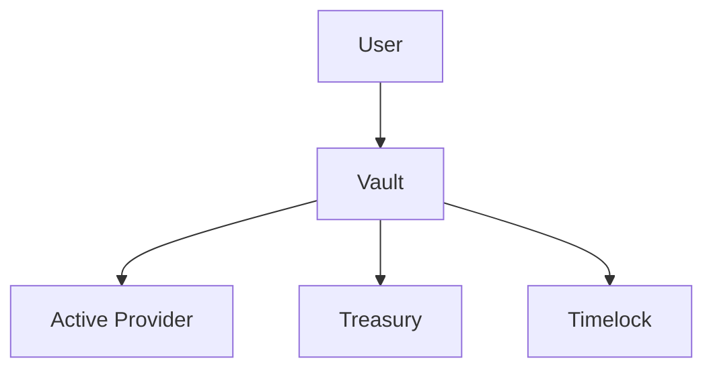
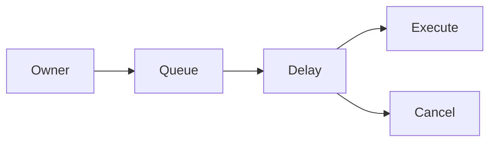
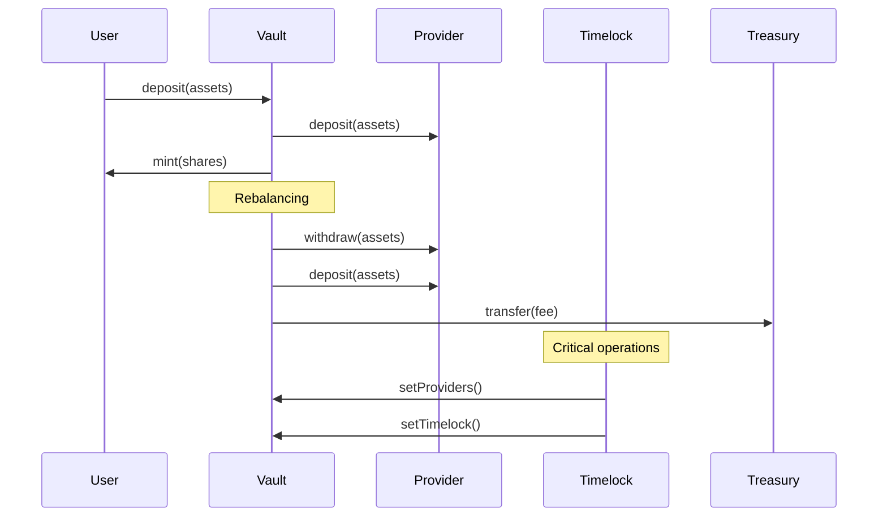

# System Architecture

## Overview

REBALANCE Finance is built on a modular architecture that provides flexibility, security, and scalability. The system consists of several key components, each performing a specific role.

## Main Components

### 1. Vault (Storage)

**File:** `contracts/base/Vault.sol`

Vault is the central component of the system, implementing the ERC4626 standard. It manages:
- User deposits and withdrawals
- Conversion between assets and shares
- Interaction with liquidity providers
- Fee collection



### 2. Rebalancer

**File:** `contracts/Rebalancer.sol`

Responsible for redistributing funds between different providers to maximize yield:

```solidity
function rebalance(
    uint256 assets,
    IProvider from,
    IProvider to,
    uint256 fee,
    bool activateToProvider
) external onlyOperator returns (bool)
```

### 3. RebalancerWithRewards

**File:** `contracts/RebalancerWithRewards.sol`

Extended version of Rebalancer with additional functionality for reward distribution.

### 4. VaultManager

**File:** `contracts/VaultManager.sol`

Centralized manager for managing multiple vaults:

```solidity
function rebalanceVault(
    IVault vault,
    uint256 assets,
    IProvider from,
    IProvider to,
    uint256 fee,
    bool activateToProvider
) external onlyExecutor returns (bool success)
```

### 5. Timelock

**File:** `contracts/Timelock.sol`

Ensures security of critical operations through a delay mechanism:



### 6. RewardsDistributor

**File:** `contracts/RewardsDistributor.sol`

Efficiently distributes rewards using Merkle proof:

```solidity
function claim(
    address account,
    address reward,
    uint256 claimable,
    bytes32[] calldata proof
) external whenNotPaused
```

### 7. ProviderManager

**File:** `contracts/ProviderManager.sol`

Manages the list of available liquidity providers.

## Liquidity Providers

The system supports the following providers:

### AaveV3Provider
- **File:** `contracts/providers/AaveV3Provider.sol`
- **Functions:** Deposits and loans in Aave V3

### CompoundV3Provider
- **File:** `contracts/providers/CompoundV3Provider.sol`
- **Functions:** Deposits in Compound V3

### DolomiteProvider
- **File:** `contracts/providers/DolomiteProvider.sol`
- **Functions:** Trading and lending in Dolomite

### FraxlendProvider
- **File:** `contracts/providers/FraxlendProvider.sol`
- **Functions:** Lending in Fraxlend

### VenusProvider
- **File:** `contracts/providers/VenusProvider.sol`
- **Functions:** Deposits in Venus Protocol

## Role-Based Access Control

### AccessManager
**File:** `contracts/access/AccessManager.sol`

Manages roles and access rights:

- **Admin** - full control over settings
- **Operator** - execute rebalancing
- **Executor** - execute transactions through VaultManager
- **RootUpdater** - update Merkle root in RewardsDistributor

### PausableActions
**File:** `contracts/base/PausableActions.sol`

Allows pausing individual actions:
- Deposit (deposits)
- Withdraw (withdrawals)
- Rebalance (rebalancing)

## Data Flow



## Security

### Inflation Attack Protection
Vault uses the `setupVault()` mechanism to prevent inflation attacks:

```solidity
function setupVault(uint256 assets) external {
    if (setupCompleted) {
        revert Vault__SetupAlreadyCompleted();
    }
    // ... setup logic
}
```

### Fee Limitations
- Maximum withdrawal fee: 5%
- Maximum rebalancing fee: 20%

### Timelock for Critical Operations
All critical operations are executed through timelock with a delay of 30 minutes - 30 days.

## Scalability

### Modular Architecture
Each component can be updated independently of others.

### Support for New Providers
New providers can be easily added through the `IProvider` interface.

### Multiple Vaults
VaultManager allows managing multiple vaults for different assets.

## Integration

### ERC4626 Compatibility
Full support for the ERC4626 standard ensures compatibility with existing DeFi protocols.

### Merkle Proof for Rewards
Efficient reward distribution without storing state for each user.

### Delegated Calls
Use of `functionDelegateCall` for interaction with providers. 