# Contract Interaction Diagram

## System Overview

This diagram shows the relationships and interactions between all contracts in the REBALANCE Finance system.

## Contract Interaction Graph

```mermaid
graph TB
    %% User Layer
    User[👤 User]
    DAO[🏛️ DAO/Governance]
    
    %% Core Contracts
    VaultManager[🏦 VaultManager]
    Timelock[⏰ Timelock]
    AccessManager[🔐 AccessManager]
    
    %% Vault Contracts
    Vault[💰 Vault]
    Rebalancer[⚖️ Rebalancer]
    RebalancerWithRewards[🎁 RebalancerWithRewards]
    
    %% Rewards System
    RewardsDistributor[🎯 RewardsDistributor]
    
    %% Provider Management
    ProviderManager[🔧 ProviderManager]
    
    %% Provider Contracts
    AaveV3Provider[🏦 AaveV3Provider]
    CompoundV3Provider[🏛️ CompoundV3Provider]
    DolomiteProvider[💎 DolomiteProvider]
    FraxlendProvider[🔗 FraxlendProvider]
    VenusProvider[🌙 VenusProvider]
    
    %% External Protocols
    AaveV3[🏦 Aave V3 Protocol]
    CompoundV3[🏛️ Compound V3 Protocol]
    Dolomite[💎 Dolomite Protocol]
    Fraxlend[🔗 Fraxlend Protocol]
    Venus[🌙 Venus Protocol]
    
    %% Treasury and Tokens
    Treasury[🏛️ Treasury]
    ERC20Token[🪙 ERC20 Token]
    
    %% User Interactions
    User -->|deposit/withdraw| Vault
    User -->|claim rewards| RewardsDistributor
    User -->|rebalance| Rebalancer
    User -->|rebalance with rewards| RebalancerWithRewards
    
    %% Governance Interactions
    DAO -->|governance| Timelock
    Timelock -->|critical operations| Vault
    Timelock -->|critical operations| VaultManager
    Timelock -->|critical operations| ProviderManager
    
    %% Access Control
    AccessManager -->|role management| Vault
    AccessManager -->|role management| Rebalancer
    AccessManager -->|role management| RebalancerWithRewards
    AccessManager -->|role management| VaultManager
    AccessManager -->|role management| RewardsDistributor
    AccessManager -->|role management| ProviderManager
    
    %% Vault Manager Interactions
    VaultManager -->|manage| Vault
    VaultManager -->|manage| Rebalancer
    VaultManager -->|manage| RebalancerWithRewards
    
    %% Vault Interactions
    Vault -->|use| ProviderManager
    Vault -->|interact| AaveV3Provider
    Vault -->|interact| CompoundV3Provider
    Vault -->|interact| DolomiteProvider
    Vault -->|interact| FraxlendProvider
    Vault -->|interact| VenusProvider
    Vault -->|send fees| Treasury
    Vault -->|hold| ERC20Token
    
    %% Rebalancer Interactions
    Rebalancer -->|inherit from| Vault
    Rebalancer -->|use| ProviderManager
    Rebalancer -->|interact| AaveV3Provider
    Rebalancer -->|interact| CompoundV3Provider
    Rebalancer -->|interact| DolomiteProvider
    Rebalancer -->|interact| FraxlendProvider
    Rebalancer -->|interact| VenusProvider
    Rebalancer -->|send fees| Treasury
    
    %% RebalancerWithRewards Interactions
    RebalancerWithRewards -->|inherit from| Rebalancer
    RebalancerWithRewards -->|distribute rewards| RewardsDistributor
    
    %% Provider Manager
    ProviderManager -->|manage| AaveV3Provider
    ProviderManager -->|manage| CompoundV3Provider
    ProviderManager -->|manage| DolomiteProvider
    ProviderManager -->|manage| FraxlendProvider
    ProviderManager -->|manage| VenusProvider
    
    %% Provider to Protocol Interactions
    AaveV3Provider -->|interact| AaveV3
    CompoundV3Provider -->|interact| CompoundV3
    DolomiteProvider -->|interact| Dolomite
    FraxlendProvider -->|interact| Fraxlend
    VenusProvider -->|interact| Venus
    
    %% Rewards System
    RewardsDistributor -->|hold| ERC20Token
    RewardsDistributor -->|emergency withdrawal| Treasury
    
    %% Styling
    classDef userLayer fill:#e1f5fe
    classDef coreLayer fill:#f3e5f5
    classDef vaultLayer fill:#e8f5e8
    classDef providerLayer fill:#fff3e0
    classDef externalLayer fill:#fce4ec
    classDef treasuryLayer fill:#f1f8e9
    
    class User,DAO userLayer
    class VaultManager,Timelock,AccessManager coreLayer
    class Vault,Rebalancer,RebalancerWithRewards,RewardsDistributor vaultLayer
    class ProviderManager,AaveV3Provider,CompoundV3Provider,DolomiteProvider,FraxlendProvider,VenusProvider providerLayer
    class AaveV3,CompoundV3,Dolomite,Fraxlend,Venus externalLayer
    class Treasury,ERC20Token treasuryLayer
```



## Detailed Interaction Flow

### 1. User Operations Flow


### 2. Rebalancing Flow


### 3. Governance Flow


### 4. Rewards Distribution Flow


## Contract Dependencies

### Inheritance Hierarchy


### Interface Implementations


## Access Control Matrix

| Contract | Admin | Operator | Executor | RootUpdater | Timelock |
|----------|-------|----------|----------|-------------|----------|
| Vault | ✅ | ❌ | ❌ | ❌ | ✅ |
| Rebalancer | ✅ | ✅ | ❌ | ❌ | ❌ |
| RebalancerWithRewards | ✅ | ✅ | ❌ | ❌ | ❌ |
| VaultManager | ✅ | ❌ | ✅ | ❌ | ✅ |
| RewardsDistributor | ✅ | ❌ | ❌ | ✅ | ❌ |
| ProviderManager | ✅ | ❌ | ❌ | ❌ | ✅ |
| Timelock | ❌ | ❌ | ❌ | ❌ | ✅ |

## Data Flow Patterns

### 1. Asset Flow
```
User → Vault → Provider → External Protocol
```

### 2. Fee Flow
```
Vault/Rebalancer → Treasury
```

### 3. Reward Flow
```
External Protocol → RebalancerWithRewards → RewardsDistributor → User
```

### 4. Governance Flow
```
DAO → Timelock → Target Contract
```

## Security Boundaries

### Critical Operations (Timelock Required)
- Provider updates
- Timelock address changes
- Major parameter changes

### Admin Operations
- Fee adjustments
- Treasury updates
- Emergency pauses
- Provider management

### Operator Operations
- Rebalancing execution
- Provider activation

### User Operations
- Deposits and withdrawals
- Reward claims
- Vault interactions

## Integration Points

### External Protocol Integration
- Aave V3: Lending and borrowing
- Compound V3: Supply and borrow
- Dolomite: Trading and lending
- Fraxlend: Lending
- Venus: Supply and borrow

### Token Integration
- ERC20: Standard token interface
- ERC4626: Vault token standard
- WETH: Wrapped ETH handling

### Governance Integration
- DAO: Decentralized governance
- Multi-sig: Multi-signature wallets
- Timelock: Delayed execution

This diagram provides a comprehensive view of how all contracts interact within the REBALANCE Finance ecosystem, showing the flow of assets, control mechanisms, and security boundaries. 